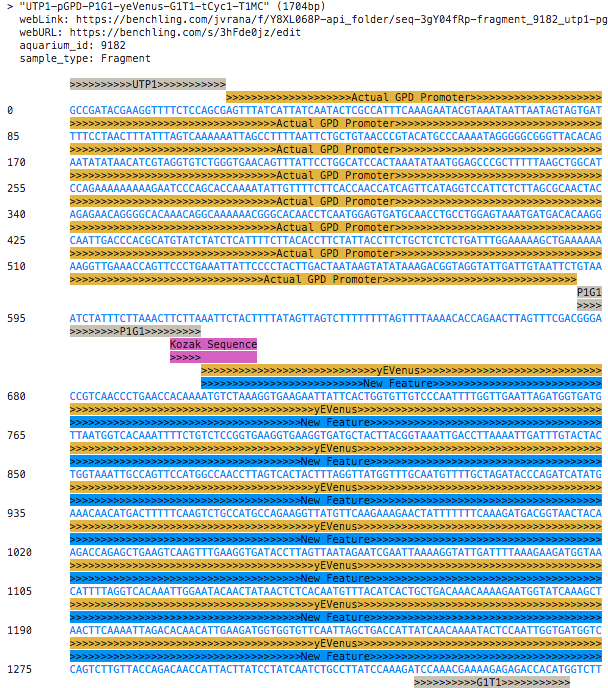

.. BenchlingPyAPI documentation master file, created by
   sphinx-quickstart on Mon Jul 16 10:09:33 2018.
   You can adapt this file completely to your liking, but it should at least
   contain the root `toctree` directive.

jdna
====

A Python DNA sequence editor that represents sequences as a linked list.
It includes basic molecular reaction simulations and a viewer class.

Indices and tables
------------------

* :ref:`genindex`
* :ref:`modindex`
* :ref:`search`

.. toctree::
   :maxdepth: 4

   self
   quickstart
   developer/api_reference

